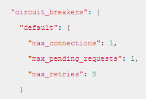

Circuit breaker:

Bulkhead pattern:

-   Prevents the entire system from failing when one part fails

-   Similar idea is used for Hystrix and Envoy circuit breaker

Hystrix:

-   Two approaches: Thread isolation and Semaphore Isolation

    -   Thread Isolation: direct all request to a separate pool with a fixed
        number of threads

    -   Semaphore: calls need to acquire a permit from the service they are
        calling before making request to that service, no permit means service
        is down and the call will be stopped

Envoy:

-   Circuit breaker:

    -   limited the number of connections and pending request

    -   number of retries are defined

    -   in practice, there are some leeway, this is not hard limits

-   Outlier detection:

    -   Detects services that are not working, or not reliable

    -   Detect then eject the service from the cluster load balancing pool, for
        a period of time (sleep window).

        -   By default, the ejected time = (\# of consecutive fails \*
            interval_ms)

    -   During the duration of sleep window, the service is excluded from
        routing and load balancing

-   Cluster Panic:

    -   Too many host ejected by the outlier detection, panic threshold default
        is 50%

    -   In panic mode, proxy will disregard all health condition of
        load-balancing pool and route to all hosts again

-   Fault tolerance

    -   Features in Istio includes retries/timeouts, circuit breaker, health
        checks, fault injection, connection pool control,
