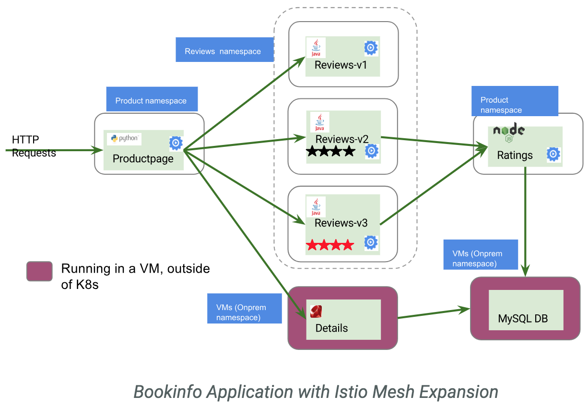
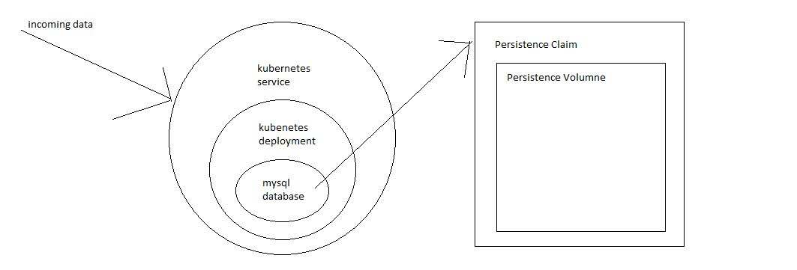

# Database Connection
Databse on Kubernetes can be set up in mostly 2 ways:
  1. Set up the database as a cluster on the kubernetes container.
  2. Set up the databse somewhere else.

## Set up Databse on an External VM with Istio Mesh Expansion

This is the instance where the database is hosted at an external location. Most likely, this option is used to connect new microservice apps to use service Entry;

1. Have a database already set up at desired location by running the .sql set up file. 

2. Obtain the host and ports of the databse. If it is on a linux machine, you can run commands:

```bash
    $export MYSQL_DB_HOST=<your MySQL database host>
    $export MYSQL_DB_PORT=<your MySQL database port>
```


Setup a table if you will, run a table initializer like this:

```sql
CREATE DATABASE test;
USE test;

CREATE TABLE `ratings` (
  `ReviewID` INT NOT NULL,
  `Rating` INT,
  PRIMARY KEY (`ReviewID`)
);
INSERT INTO ratings (ReviewID, Rating) VALUES (1, 5);
INSERT INTO ratings (ReviewID, Rating) VALUES (2, 4);
```

The SQL file above

3. For the sake of development, you could grant access to a specific user or all users using: 

```sql
GRANT ALL PRIVILEGES ON *.* TO 'root'@'localhost' IDENTIFIED BY 'password' WITH GRANT OPTION;
quit;
```

4. In the deployment yaml of the application that reference the database table, enter the following configuration to supply connection details.

```yaml
apiVersion: extensions/v1beta1
kind: Deployment
metadata:
  name: friend-service
spec:
  replicas: 1
  template:
    metadata:
      labels:
        app: friend-service
        version: v2-mysql-vm
    spec:
      containers:
      - name: ratings
        image: friend-service:v0
        imagePullPolicy: IfNotPresent
        env:
          # This assumes you registered your mysql vm as
          # istioctl register -n vm mysqldb 1.2.3.4 3306
          - name: DB_TYPE
            value: "mysql"
          - name: MYSQL_DB_HOST
            value: mysqldb.vm.svc.cluster.local
          - name: MYSQL_DB_PORT
            value: "3306"
          - name: MYSQL_DB_USER
            value: root
          - name: MYSQL_DB_PASSWORD
            value: password
        ports:
        - containerPort: 9080
```

The 'env' section sets the environment varible for the friend-service, and is also where the necessary parametes are supplied.

5. Register istio with the location of the VM on which the database is hosted: 

```bash
    $istioctl register -n vm mysqldb <ip-address-of-vm> 3306`
```

where

```bash
 -n <name-of-VM> <ip-address-of-vm> <port>
```

## Set up Databse on an External VM with external TCP connection

Replace step 4 and onwards with the following setup: 

5. Write a Service Entry that would detail the connection host, path, and location in the deployment.yaml file

```yaml
apiVersion: networking.istio.io/v1alpha3
kind: ServiceEntry
metadata:
  name: mysql-external
spec:
  hosts:
  - $MYSQL_DB_HOST
  addresses:
  - $MYSQL_DB_IP/32
  ports:
  - name: tcp
    number: $MYSQL_DB_PORT
    protocol: tcp
  location: MESH_EXTERNAL
```

### Comparison of Mesh Expansion and Service Entry

Due to the containerized nature of istio environment, it is not able to discover services outside of the mesh. Hence it is necessary to a service entry to allow access to the outside components. This is different than in the previous example of 'Set up Databse on an External VM with Istio Mesh Expansion', where the command 'istioctl register <vm> <host> <port>' performs a mesh expansion to include the external service which elevate the ability to enjoy any feature internal services have.

In the case of Istio Mesh Expansion, the Istio component(Envoy proxy, node-agent, istio-agent) must be added to the external databse, and the istio's control plane (Pilot, Mixer, Citadel) must be able to access it.

Because mesh expansion includes the external database into the mesh, the traffic into the database are still regarded as internal traffic. Consequently, this effectively avoided exiting bottle neck and service entry configuration

However, there is a warning given by Istio that:

**Warning Mesh expansion is broken in the initial release of Istio 1.0. We expect to have a patch available that fixes this problem very soon. We apologize for the inconvenience.**

So far the most convinent way is to utilize external TCP through service entry to connect to an external DB. 


## Spawn database as a Pod in kubernetes Cluster

A databse can be spawned on a kubernetes pod similar to the way a service is done. It is generally not recommended though, to store a stateful database on a stateless kubernetes cluster. This is because a database is stateful, where it would require the state of the media to complete its task. A stateless container  does not offer offers the ability to be quickly brought online or off, which is one that the databse do not need. On the other hand, the container would restrict the throughoutput to decrease the speed of database processing. It is best use to store a small amount of data for immediate use for transient purpose. For example, developing, testing, temperary data storing.

## SQL VS NoSQL databse

SQL is relational and NoSQL is non-relational. SQL stores data in tables, so to store and access data of an object, multiple sql tables may be consulted. On the other hand NoSQL store data into an object as it is. Let's say we want to store an object called friend that has their name, address, and gender, as well as their friends:

```json
friend: {
  name: "json",
  gender: "binary",
  address: "0x677882"

  friends: [
    "xml",
    "soap",
    "yaml"
  ]

}
```

In NoSQL it will be store as it is, in SQL, it will most likely be store into 2 tables:

'friend' table

| id | name  | gender |  address  |
|----|-------|--------|-----------|
| 1  | json  | binary | 0x677882  |
| 2  | soap  | ...    | ...       |
| 3  | ...   | ...    | ...       |

'friends' table

| id | friends |
|----|---------|
| 1  | 2,3,4  |
| 2  | 1,5,3 |
| 3  | 7,9,4 |


It is recommended, to store database connection detail in config map, and connection authentication in

# System Diagram

## Sprincube call and data flowchart


First the user makes a call and it it is been sent through ingress gateway. Then the bff service which listens at 
the ingress gate way sends the request into subsequent services. The services can send communicate with each other 
and so can they listen directly from the ingress gateway. All processing data are again sent to telemetry. 

## Three Senarios of Database: 
#### Senario one: external db out of the mesh
[](https://istio.io/blog/2018/egress-tcp/)
the databse is hosted externally outside of kubernetes outside of mesh. It uses a service entry to enter the external databse

#### Senario two, Mesh Expansion:
[](https://medium.com/ibm-cloud/istio-mesh-expansion-on-ibm-cloud-private-c335eabf7990)
The database is hosted outside of kubernetes and local machine, but is part of the Istio mesh through Mesh expansion.
This elevate the database to be elevated as a super member meanwhile not requiring it to be spawned as a node in
kubernetes.

#### Scenario three, spawn up a deployment in kubernetes
[](https://kubernetes.io/docs/concepts/storage/persistent-volumes/)
spawn a kubernetes deployment of mysql and points it to a persistence claim

# Config Maps and Sercrets
Both Configure maps and secrets provide environment variables to be used in the cluster that one would otherwise not want to have directly hard coded in each container's deployment file. This could be for a number of reasons; 
1. The Pod Creator does not know the value of the environmental variable but will get it from some one. 
2. The variable will be shared across multiple containers. 
3. The value will want to be hidden from the user (use secrets) 
