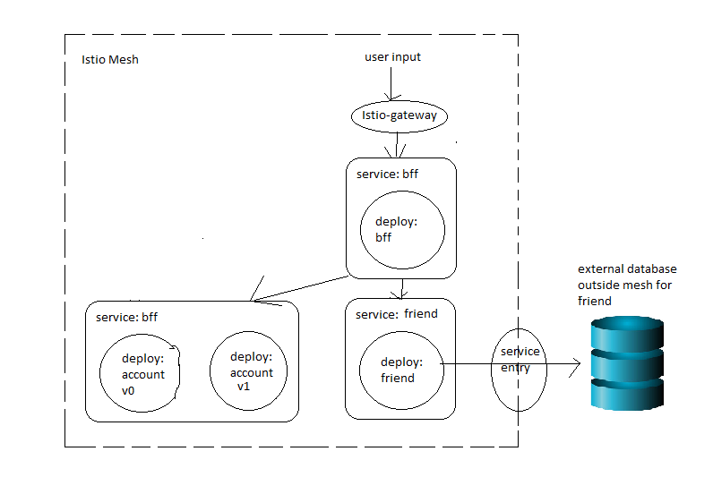
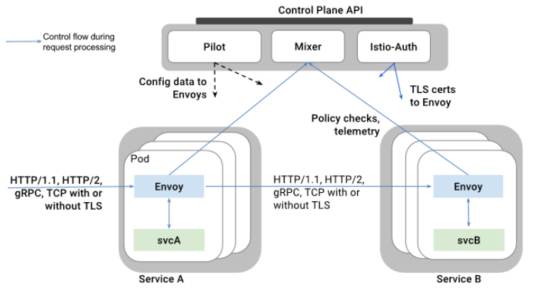
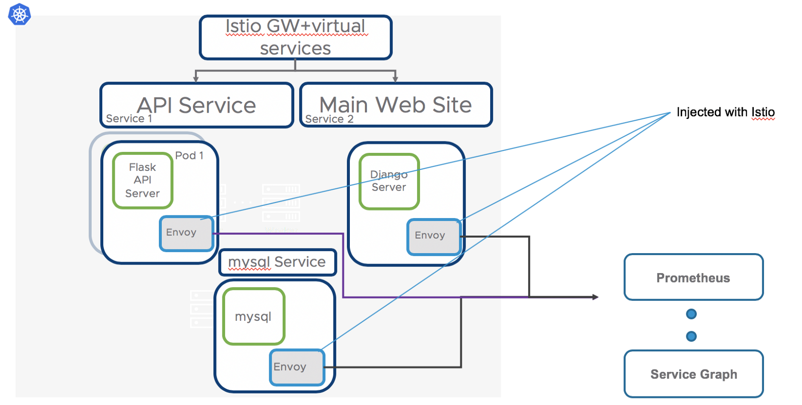
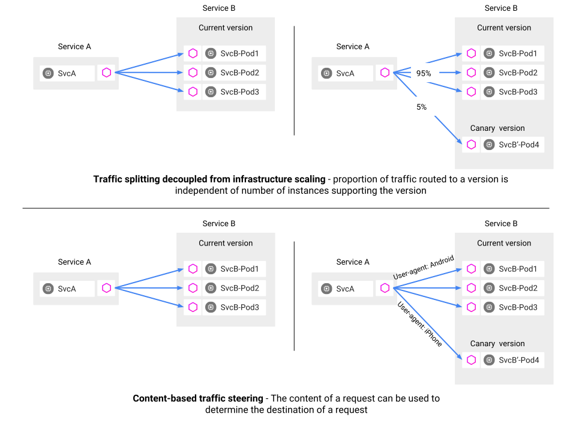
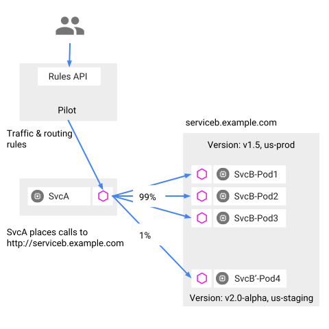
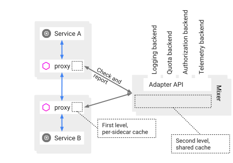
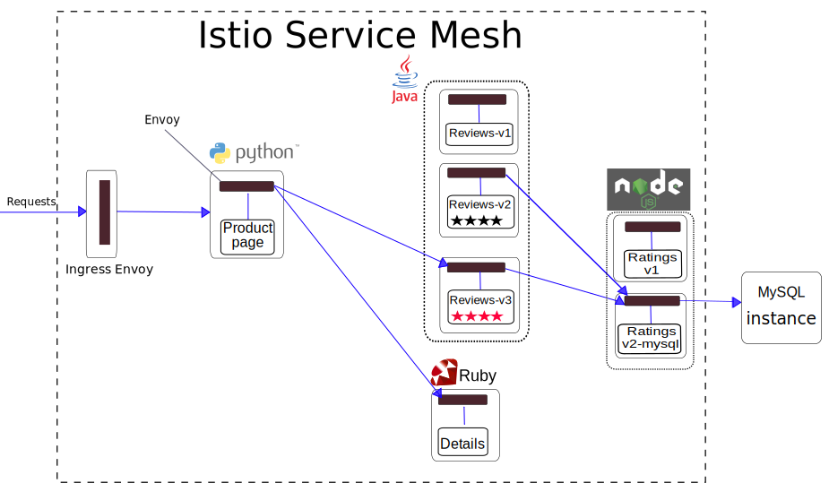
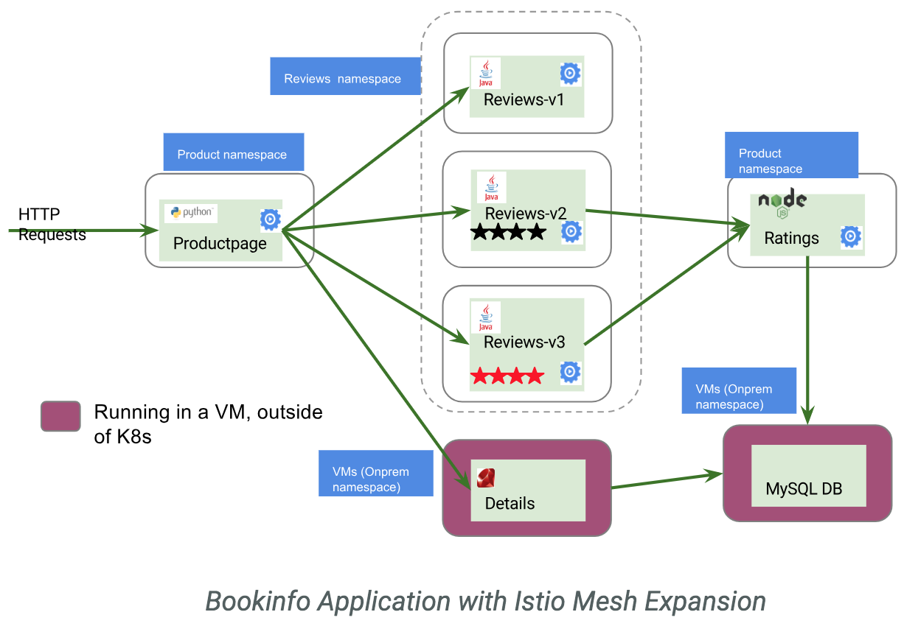
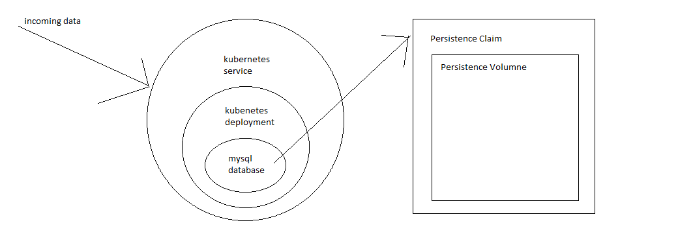

# System Diagram

## Sprincube call and data flowchart

First the user makes a call and it it is been sent through ingress gateway. Then the bff service which listens at 
the ingress gate way sends the request into subsequent services. The services can send communicate with each other 
and so can they listen directly from the ingress gateway. All processing data are again sent to telemetry. 

## Service and Deployment 

Service to service traffics are managed by the Istio Control Plane, which includes components such as Pilot and Mixer.
Istio configures and monitors the traffic through Envoy and is able to control the flow of the traffic using the
configurations in the control plane.

## Istio Injection

Istio is added to support the service by deploying a special Envoy sidecar proxy to each of the pods.The Envoy 
proxy intercepts all network communication between microservices and manage the traffic according to configurations

## Canary Deployment with Istio Pilot

Two example scenarios to do canary deployment with Istio Pilot traffic management. In the first one, a new version is 
published and a portion of the traffic is routed to the new version. If the new version is stable, then traffic 
will be gradually shifted to the new version. In the second scenario, only specific users can access the new version.

##Pilot

Client of a service has no knowledge of the different versions. Envoy proxy intercpes and forward all requests
between client and the service. Envoy determines the choice of service version dynamically based on the routing rules
which are specified by Pilot. Load balancing between different instances of the same version is also done by Pilot
configurations. However, service discovery via DNS is not provided and is instead using the Kubernetes built-in DNS.

## Mixer

Istio Mixer is the component that provides policy controls and telemetry collection. As shown in the diagram, Envoy 
calls Mixer before each request to perform precondition checks and after each request to report telemetry.
Envoy also contains a local cache so it can make the calls to Mixer less frequently. Mixer then communicates with the
backend APIs to carry out policy enforcement and telemetry collection.

## Three Scenarios of Database: 
#### Scenario one: external db out of the mesh

the databse is hosted externally outside of kubernetes outside of mesh. It uses a service entry to enter the external databse

#### Scenario two, Mesh Expansion:

The database is hosted outside of kubernetes and local machine, but is part of the Istio mesh through Mesh expansion.
This elevate the database to be elevated as a super member meanwhile not requiring it to be spawned as a node in
kubernetes.

#### Scenario three, spawn up a deployment in kubernetes

spawn a kubernetes deployment of mysql and points it to a persistence claim