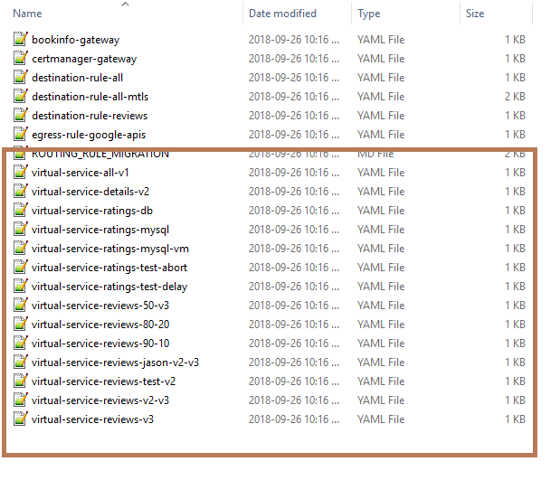
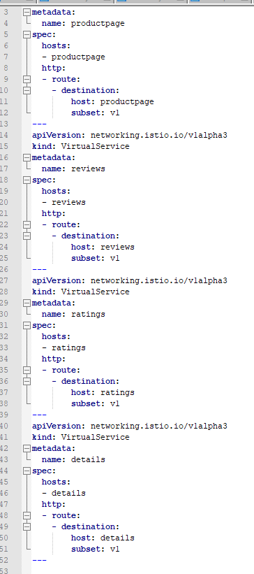

# Ymal File Structure(best practice)

[Official Docs](https://kubernetes.io/docs/concepts/configuration/overview/) 

# All in one (Istio Official)
always put environment related deployment first. This means path config, secrets, and service entry will be deployed before
service, pod and deployment. This is because, a deployment will need to rely on variables supplied from environment and 
cannot pick up newly added configurations on the fly. However, in the case of multiple versions of a virtual service with 
same name, one has to put them in different files, or else result in a conflict.

For example, in [istio's official demos](../istio-1.0.2/samples/bookinfo/networking): 


Each file is a mutation of the virtual services of the 4 services. Because they describe different behavior of the
same object, they are separated into different files. Putting them in the same file would result in conflict. 

In each of the file, all virtual services are described: 



# Separate into Components
However, there are 
[voices online calling for segregating components into its own files](https://blog.alexellis.io/move-your-project-to-kubernetes/) for the sake of segregation
of concern. For example
```bash 
gateway-svc.yml // for Service
gateway-dep.yml // for Deployment
```


# Configuration rolling update
[An approach found online recommends writing a script that would trigger redeployment upon configuration changes](https://boxboat.com/2018/07/05/gitops-kubernetes-rolling-update-configmap-secret-change/)


# Configuration Best practice
1. Specify latest stable API verison
2. Config files sore in version control before deploy in the cluster, this allows quick roo back and recreation, restoration
3. Write in YAML not JSON
4. ```Group related into one file whenever it makes sense```, since one file is easier to manage one file
5. can call ```kubectl apply -f <directory>``` on a collection of object
6. put description in annotation
 
 


